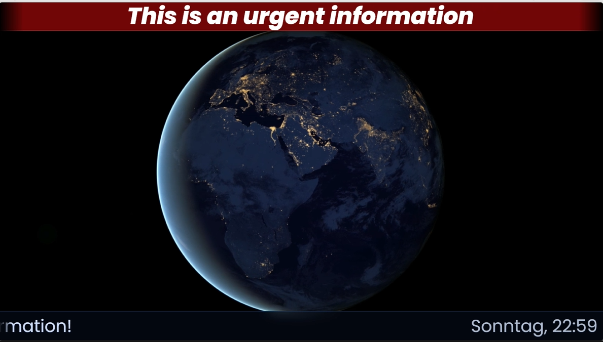

# DreamSignageX

DreamSignageX ist ein Fork von [DreamSignage](https://github.com/Ammarillo/DreamSignage) von [Aurelio Brenker (Ammarillo)](https://github.com/Ammarillo) — vielen Dank für die tolle Grundlage!

[](docs/use.mp4)

---

Das Ziel war es, ein einfaches Digital Signage System zu entwickeln, welches mehrere unterschiedliche Screens bedienen kann.

Auf ein aufwändiges Admin-UI wurde bewusst verzichtet — mal ehrlich: Die meisten wollen einfach nur ein Bild, eine PDF oder ähnliches anzeigen. Das alles ist möglich ohne aufwändige Rechtevergabe oder Schulung der Nutzer.

Da alle Inhalte in einem Verzeichnis auf dem Server abgelegt werden, können bestehende Fileserver-Strukturen einfach mit Bordmitteln (z.B. CIFS) eingebunden werden und sofern notwendig die Rechtevergabe mit AD-Berechtigungen realisiert werden.

---

## Features

### Kernfunktionen (aus dem Original übernommen)
- **Vielseitige Dateianzeige**: Unterstützung für Bilder, Videos, PDFs und iFrame-URLs
- **Vollbildmodus**: Inhalte werden ablenkungsfrei im Vollbild dargestellt
- **Responsives Design**: Automatische Anpassung an Bildschirmgröße und -auflösung
- **Mehrseitige PDF-Anzeige**: PDF-Dateien werden Seite für Seite angezeigt
- **Konfigurierbarer Anzeigetimer**: Anzeigedauer pro Inhalt frei einstellbar
- **Offline- und Netzwerkbetrieb**: Vollständiger Betrieb im lokalen Netzwerk ohne Internetzugang möglich
- **WebSocket-Integration**: Inhalte werden automatisch aktualisiert sobald sich Dateien ändern (Socket.IO)
- **Cross-Platform**: Serverseitige Unterstützung für Linux und Windows
- **HTTPS-Unterstützung**: Optionaler sicherer Betrieb über HTTPS

---

## Was ist neu gegenüber dem Original?

### Laufschriften (Ticker)
- `<marquee>`-Tags vollständig durch CSS `@keyframes`-Animation ersetzt → funktioniert in allen modernen Browsern inkl. Edge
- Zwei unabhängige Ticker: **Urgent** (rot, oben) und **Info** (blau, unten)
- Ticker erscheinen **nur wenn Text vorhanden** ist — kein dauerhaftes Überdecken von Inhalten
- Sanfter Übergang bei Textänderungen: neuer Text wird erst am Ende des aktuellen Durchlaufs gewechselt (`animationiteration`-Queue)
- **Dedup-Mechanismus**: Animation startet nicht neu wenn sich der Text nicht geändert hat
- Scrollen via CSS-Klasse (`.scrolling`) statt Inline-Style — zuverlässiger Start auch nach leerem Zustand
- Laufschrifttext wird serverseitig getrimmt (kein `\r\n` aus Textdateien)

### Design
- Modernes **Glasmorphism**-Design mit `backdrop-filter: blur()` für Ticker und Uhr
- Ticker sind semitransparent — Hintergrundinhalte sind durchgehend sichtbar wenn kein Text aktiv ist
- Einheitliche **untere Statusleiste** (`#bottombar`): Info-Ticker und Uhr teilen sich einen gemeinsamen Hintergrund ohne Naht
- **Edge-Fade** auf den Laufschriften (`mask-image`) für einen professionellen Rundfunk-Look
- Uhr immer per `drop-shadow` lesbar, auch ohne aktive Infozeile

### Dateiformat-Unterstützung
Alle Formate werden **case-insensitiv** erkannt (`.jpg`, `.JPG`, `.Jpg` etc.):

| Kategorie | Formate |
|-----------|---------|
| Bild | `.jpg` `.jpeg` `.jfif` `.png` `.gif` `.webp` `.svg` `.svgz` `.bmp` `.ico` `.avif` |
| Video | `.mp4` `.webm` `.ogv` `.ogg` |
| Dokument | `.pdf` |
| URL/iFrame | `.json` (`{"url": "https://..."}`) |

### Fehlerbehebungen
- **Uhr friert nicht mehr ein**: `Reset()` bei Content-Wechsel nutzt jetzt explizites Timeout-Tracking statt Brute-Force-Clearing aller Timeouts. Die Uhr läuft über `setInterval` und ist davon grundsätzlich unberührt.
- **Anzeigedauer vom Server**: `contentIntervall`-Einstellung aus `config/default.json` wird jetzt korrekt an den Client übertragen und verwendet (war bisher durch einen Key-Mismatch immer ignoriert)
- **Ticker nach leerem Text**: Nach dem Leeren einer `.txt`-Datei und erneutem Befüllen wird der neue Text nun zuverlässig angezeigt
- **Video-Listener**: `loadeddata`/`error`-Handler mit `{ once: true }` — kein Aufstapeln nach Content-Reload
- **URL-Handler**: Null-Check für fehlerhafte JSON-Dateien ergänzt
- Ungültige `font-style: bold` (kein gültiger Wert) bereinigt

### Entfernt gegenüber dem Original
- **Automatische ZIP-Updates**: Die Funktion zum automatischen Abruf und Entpacken von Inhalten aus einer Remote-ZIP-Datei wurde entfernt. Der Fokus liegt auf direkter Dateiablage (z.B. per CIFS/SMB-Mount).

---

## Laufschrift-Steuerung

In jedem Display-Ordner können optional zwei Textdateien abgelegt werden:

| Datei | Funktion |
|-------|---------|
| `urgent.txt` | Roter Ticker oben — Dringendmeldungen |
| `info.txt` | Blauer Ticker unten — allgemeine Informationen |

Der Server liest diese Dateien bei jedem Scan-Intervall. Datei löschen oder leeren → Ticker verschwindet automatisch.

---

## Ordnerstruktur für Inhalte

Jeder Screen entspricht einem Unterordner im `public/content/`-Verzeichnis:

```
public/content/
├── screen1/
│   ├── 01_begruessung.jpg
│   ├── 02_programm.pdf
│   ├── info.txt          ← optionaler Info-Ticker
│   └── urgent.txt        ← optionaler Dringend-Ticker
└── screen2/
    └── video.mp4
```

Der Screen ist erreichbar unter `http://server:port/screen1`.

Dateien werden in **alphabetisch-numerischer Reihenfolge** angezeigt — durch vorangestellte Zahlen (`01_`, `02_`, ...) lässt sich die Reihenfolge steuern.

---

## Konfiguration

`config/default.json`:

```json
{
  "config": {
    "scanIntervall": 5,
    "contentIntervall": 20,
    "backgroundColor": "#141414",
    "httpPort": 3000,
    "useSSL": false,
    "sslkey": "/etc/example/privatekey.pem",
    "sslCert": "/etc/example/fullchain.pem",
    "sslPort": 3001,
    "useZipDownload": false,
    "zipURL": "https://example.com/path/to/content.zip",
    "zipDownloadIntervall": 60,
    "keepFiles": false
  }
}
```

| Einstellung | Beschreibung |
|-------------|-------------|
| `scanIntervall` | Sekunden zwischen zwei Inhaltsprüfungen |
| `contentIntervall` | Anzeigedauer pro Bild/PDF-Seite in Sekunden |
| `backgroundColor` | Hintergrundfarbe des Displays (Hex) |
| `httpPort` | HTTP-Port des Servers |

---

## Installation & Start

```bash
git clone https://github.com/kats-reichert/DreamSignage.git
cd DreamSignage
npm install
node server.js
```

Voraussetzung: **Node.js ≥ 18.15.0**

Für den produktiven Einsatz empfiehlt sich `pm2` oder ein systemd-Service.

---

## Lizenz

Dieses Projekt basiert auf [DreamSignage](https://github.com/Ammarillo/DreamSignage), lizenziert unter der ISC License.
